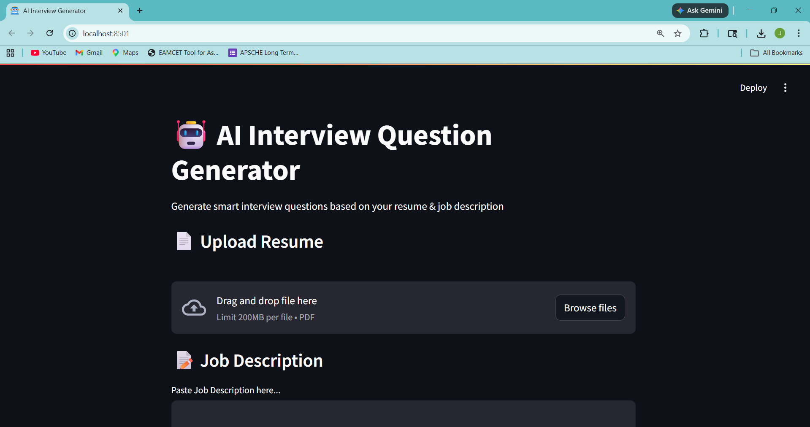

# 🤖 AI Resume Analyzer & Interview Question Generator

An AI-powered application that analyzes resumes and generates tailored interview questions based on a given job description using modern GenAI techniques.

---

## 🚀 Features

* 📄 Upload Resume (PDF)
* 🧠 AI-based Interview Question Generation
* 🎯 Categorized Questions:

  * Technical Questions
  * HR Questions
  * Project-Based Questions
* 📥 Download Questions as PDF
* ⚡ FastAPI Backend for scalable API handling
* 🎨 Streamlit Frontend for interactive UI

---

## 🏗️ Project Architecture

```
frontend (Streamlit UI)
        ↓
FastAPI Backend
        ↓
LangChain Pipeline (Prompt → LLM → Parser)
        ↓
Structured Output (Pydantic)
```

---

## 🛠️ Tech Stack

* **Backend:** FastAPI
* **Frontend:** Streamlit
* **LLM:** Groq (LLaMA 3.1)
* **Framework:** LangChain (LCEL)
* **Validation:** Pydantic
* **PDF Generation:** ReportLab

---

## ⚙️ Installation & Setup

### 1. Clone the Repository

```bash
git clone https://github.com/john-victor-000/AI-Interview-Questions-Generator
cd your-repo
```

### 2. Create Virtual Environment

```bash
python -m venv venv
source venv/bin/activate   # Windows: venv\Scripts\activate
```

### 3. Install Dependencies

```bash
pip install -r requirements.txt
```

### 4. Setup Environment Variables

Create a `.env` file in root:

```env
GROQ_API_KEY=your_api_key_here
```

---

## ▶️ Run the Application

### Start Backend

```bash
uvicorn backend.main:app --reload
```

### Start Frontend

```bash
streamlit run frontend/app.py
```

---

## 🧠 How It Works

1. User uploads resume + job description
2. Resume text is extracted
3. LangChain pipeline processes input:

   * PromptTemplate
   * LLM (Groq)
   * PydanticOutputParser
4. Structured interview questions are generated
5. Results displayed in UI + downloadable as PDF

---

## 📌 Key Concepts Used

* LangChain Expression Language (LCEL)
* Prompt Engineering
* Structured Output Parsing
* API-based LLM Integration
* Modular Backend Design

---

## 📷 UI Preview



---

## 🔐 Security Note

* API keys are stored securely using `.env`
* Sensitive files are excluded via `.gitignore`

---

## 🚀 Future Enhancements

* Difficulty-based questions (Easy/Medium/Hard)
* Company-specific interview preparation
* Resume feedback & scoring

---

## 👨‍💻 Author

**John Victor Dabbakuti**

B.Tech CSE-Data Science ( 2022 - 2026)

Gen AI Trainee at Innomatics Research Labs

---

## ⭐ Support

If you found this project useful, consider giving it a ⭐ on GitHub!
